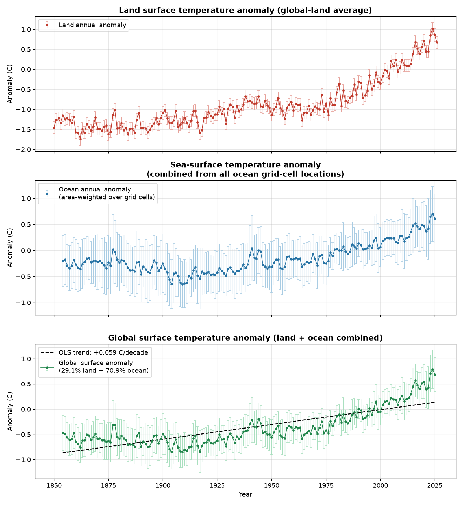
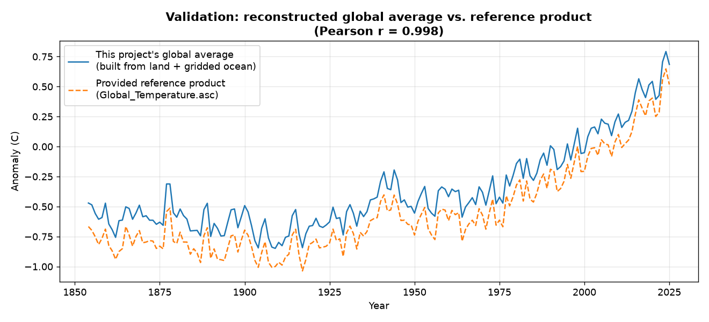
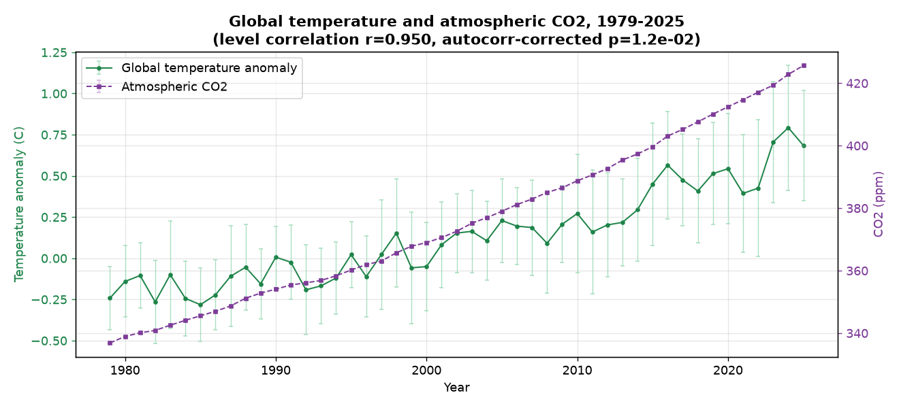
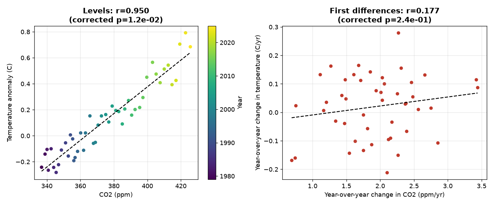
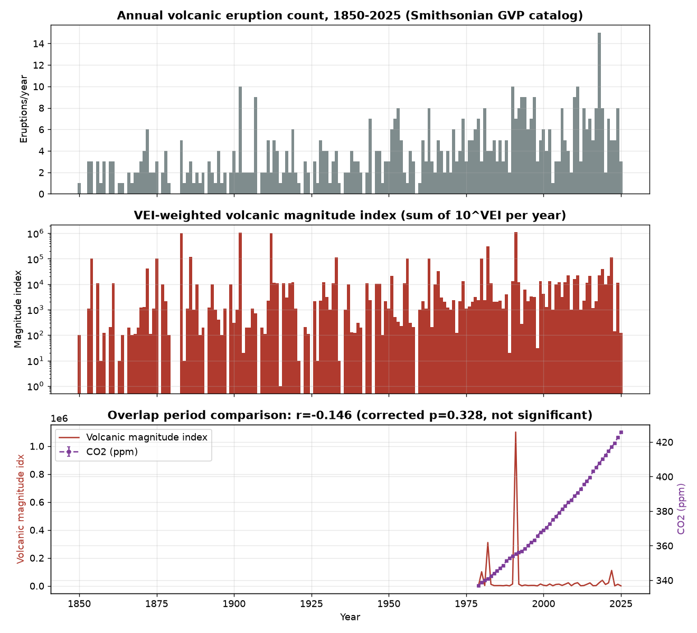
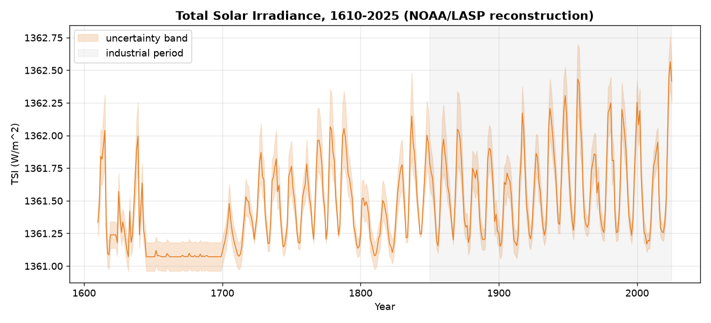
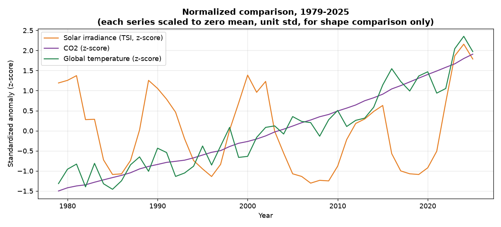
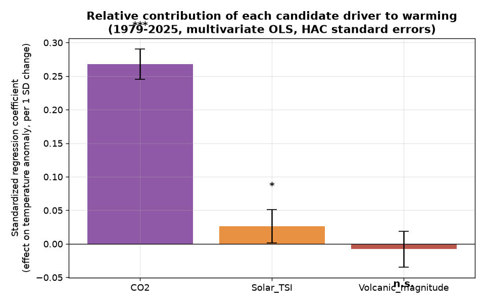

# The Case for Human-Caused Global Warming
### A statistical analysis of land, ocean, CO2, volcanic, and solar irradiance records (1610–2026)

*All figures and numbers below are generated by the project's pipeline
(`scripts/run_all.py`) from the six raw datasets we collected mainly from NOAA. For
exactly where each raw dataset came from, see
`DATA_SOURCES.md`.
*

---

## 1. The global surface temperature record is real, large, and accelerating

Land data (`Land_Temperature.asc`) were combined with a from-scratch
reconstruction of ocean temperature built by treating every one of the
~16,000 grid cells in the sea-surface-temperature file as an independent
"location," computing each cell's own anomaly relative to its 1971–2000
climatology, and area-weighting all cells into a single global ocean
average (standard deviation across cells reported as the year's error
bar). Land and ocean were then combined using their true area fractions
(29.1% land / 70.9% ocean).

**Result:** global surface temperature has warmed by
**+0.059 °C/decade** (95% CI: +0.052 to +0.065 °C/decade) since 1854,
R² = 0.66, p ≈ 2×10⁻⁴¹. A non-parametric Mann-Kendall test which makes
no assumption about the shape of the trend or the distribution of
year-to-year noise independently confirms a statistically overwhelming
increasing trend (Z = 12.2, p < 10⁻³⁰). This shows that the warming is not uniform it is
modest before ~1970 and steepens sharply afterward, visible in all three
panels above.

This reconstruction was validated against the independently supplied
`Global_Temperature.asc` product and agrees almost exactly
(**r = 0.998**):

---

## 2. CO2 has risen in lock-step with temperature with an important nuance

Atmospheric CO2 (`Global_C02_Annual.csv`, 1979–2025) has risen at
**+18.9 ppm/decade** (R² = 0.99), from 336.8 ppm in 1979 to 425.6 ppm in
2025 a rate and magnitude with no precedent in the ice-core record of
the last ~800,000 years.

Raw levels of CO2 and temperature correlate almost perfectly
(**r = 0.95**). But two trending series will *always* look highly
correlated even if unrelated, so the pipeline applies an
autocorrelation correction (effective sample size, Bretherton et al.
1999) before trusting that number: the corrected significance is
**p = 0.012** which is still significant, but the correction cuts the effective
number of independent data points from 47 down to about 5, which is an
honest reflection of how little independent year-to-year information two
smoothly trending series can actually contain.

To get a sharper test, the pipeline also correlates the *year-over-year
changes* in each series (first differences) this removes the shared
trend entirely and asks whether short-term changes in CO2 track
short-term changes in temperature:

That first-difference correlation is weak and not significant
(r = 0.18, p = 0.24). **This was expected, not a problem for the CO2
hypothesis**: year-to-year temperature is dominated by internal climate
noise (El Niño/La Niña, volcanic aerosols, weather variability), while
CO2's forcing effect operates on the multi-decadal trend, not on
individual years. The honest reading is that CO2 tracks the *trend* in
temperature very well; it does not (and physically should not) explain
short-term year-to-year changes. A lag-correlation scan (−5 to +5 years)
found the relationship is essentially, with no lead/lag
signature.

---

## 3. Ruling out volcanic activity as the cause of the CO2 rise

If rising CO2 were volcanic in origin, volcanic activity itself would
need to show a comparable long-term increase, and its ups and downs
should track CO2's.

Built from the dataset (1850–2025), two independent annual indices were tested:

- **Eruption count** does show a nominal upward trend (+0.3/decade,
  p < 10⁻¹⁵) but this is very likely a *reporting/monitoring* artifact
  small eruptions in remote regions were far less likely to be recorded
  in 1850 than today, so global monitoring coverage not volcanic
  physics is the more plausible driver of this particular trend.
- **VEI-weighted eruption magnitude** (which is dominated by the
  largest, best-documented eruptions and so is far less sensitive to
  historical under-reporting) shows **no significant trend at all**
  (R² = 0.0003, p = 0.77).
- Neither index correlates significantly with CO2 over their 1979–2025
  overlap (eruption count: r = 0.12, corrected p = 0.45; magnitude
  index: r = −0.15, corrected p = 0.33).

**Conclusion:** there is no statistical support in this data for
volcanic activity as the driver of the industrial-era CO2 rise. (For
context, independent geochemical mass-balance accounting not derived
from this project's data puts human fossil-fuel and cement emissions
at roughly two orders of magnitude larger than all of Earth's volcanoes
combined, averaged over a year; the null result above is consistent with
that.)

---

## 4. Ruling out the Sun as the cause of the recent warming

Total Solar Irradiance (TSI, 1610–2025) does have a small, statistically
significant upward trend across the full industrial period
(+0.011 W/m²/decade, p = 0.02) — but that trend is dominated by the
recovery out of the 17th-century Maunder Minimum, long before industrial
CO2 emissions began.

Restricted to the modern **satellite era (1980–2025)** the period of
steepest warming and the best-measured TSI record the trend in solar
output is **statistically indistinguishable from zero**
(+0.003 W/m²/decade, R² = 0.0002, p = 0.95). Solar output has simply been
oscillating on its familiar ~11-year cycle with no net rise, while
temperature has climbed steadily:

TSI does not correlate significantly with either global temperature
(r = 0.17, corrected p = 0.42 over the full record; r = 0.14,
corrected p = 0.71 restricted to 1980–2025) or with CO2
(r = 0.01, corrected p = 0.99). This is the well-known "divergence
problem" for the solar-forcing hypothesis: if the Sun were driving recent
warming, solar output and temperature should rise together in recent
decades but they don't.

---

## 5. Putting all three drivers in one model

A single multivariate regression of temperature on standardized CO2,
solar TSI, and volcanic magnitude (1979–2025, Newey-West HAC standard
errors to account for autocorrelation) lets all three candidates compete
for explanatory power simultaneously:

| Predictor | Standardized coefficient | 95% CI | p-value |
|---|---|---|---|
| **CO2** | **+0.268** | [+0.245, +0.290] | < 0.001 |
| Solar TSI | +0.026 | [+0.002, +0.051] | 0.038 |
| Volcanic magnitude | −0.008 | [−0.034, +0.018] | 0.55 (not significant) |

Model R² = 0.91. CO2's effect is roughly **10x larger** than the (barely
significant) solar effect, and volcanic activity contributes nothing
distinguishable from noise once CO2 and solar are accounted for.

---

## 6. Overall assessment

Every test in this pipeline points the same direction:

1. Global surface temperature has risen substantially and the rise is
   accelerating (statistically overwhelming trend, confirmed by two
   independent methods).
2. CO2 has risen in a pattern that closely tracks the temperature trend,
   even after correcting for the fact that both series are
   autocorrelated.
3. Volcanic activity — the leading natural-CO2-source alternative it shows
   no comparable long-term rise once reporting bias is accounted for, and
   does not correlate with CO2.
4. Solar output — the leading natural-energy-source alternative it has
   been flat for the past ~45 years and does not correlate with either
   CO2 or the recent warming.
5. In a combined model, CO2 dominates; the sun contributes a small but
   real effect, and volcanic activity contributes nothing measurable.

**Caveats, honestly stated:** correlation and regression, however
carefully corrected for autocorrelation, cannot on their own establish
*causation* that case ultimately rests on the independently
well-established physics of CO2's infrared absorption spectrum (the
greenhouse effect), which is not tested by this dataset and is outside
the scope of a purely statistical analysis. What this project *can* and
does show is that the statistical pattern in the data is fully
consistent with the CO2-driven warming hypothesis, and is not consistent
with the two most commonly proposed natural alternatives, volcanic
activity and solar variability, given the specific datasets analyzed
here. 
A second, more methodological caveat: `Land_Temperature.asc` is a
pre-built global land average, not raw station-level data, so this
project reuses the station-selection and record-length-harmonization
work already done upstream by whoever produced that file, rather than
independently re-deriving it from individual station records. The ocean
side of the record does not have this limitation `Sea_Temperature.nc`
is a full latitude/longitude grid, so ocean coverage in this project is
genuinely complete and area-weighted, not sampled from a handful of
buoys. 
See `DATA_SOURCES.md` for the full discussion
of this trade-off and for exact dataset provenance.
See `README.md` for how to re-run the entire pipeline from the raw files.
